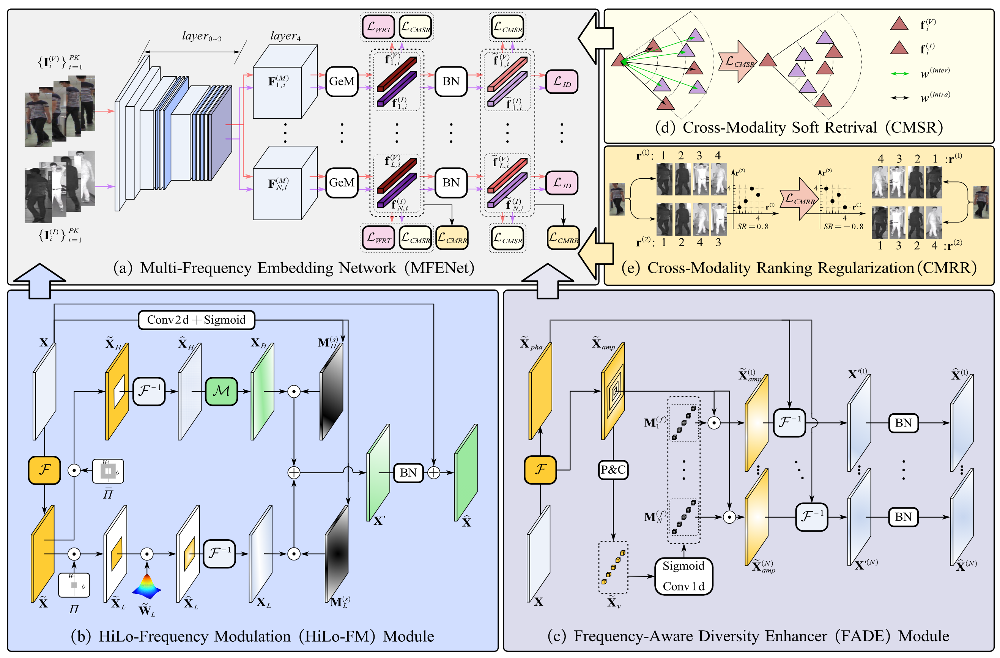

# Discovering Multi-Frequency Embedding for Visible-Infrared Person Re-identification
The *official* repository for [Discovering Multi-Frequency Embedding for Visible-Infrared Person Re-identification](https://ieeexplore.ieee.org/document/11175191)[TCSVT 2025].



## Requirements

### Installation
```bash
conda env create -f environment.yml
conda activate your_environment_name
```
We recommend to use one 24G RTX 4090 for training and evaluation. If you find some packages are missing, please install them manually. 


### Prepare Datasets

All the datasets should be downloaded on your own. All the datasets should be organized as follows:
```
dataroot
├── LLCM
│   └── idx
│   └── nir
│   └── test_nir
│   └── test_vis
|   └── vis
├── SYSU-MM01
│   └── cam1
│   ...
├── RegDB
│   └── idx
│   └── ...
```

Please modify 'args.dataroot' to the corresponding path.

## Pre-trained Models 
Please download these pre-trained ResNet models into corresponding path, or you can just change these paths.
```python
_backbones = {
   'resnet18': ['resnet18.tv_in1k', '/root/data/.cache/models/resnet18-5c106cde.pth'],
   'resnet34': ['resnet34.tv_in1k','/root/data/.cache/models/resnet34-333f7ec4.pth'],
   'resnet50': ['resnet50.tv_in1k','/root/data/.cache/models/resnet50-0676ba61.pth'],
   'resnet101': ['resnet101.tv_in1k','/root/data/.cache/models/resnet101-5d3b4d8f.pth'],
}
```

## Acceleration Candy for Evaluation
To accelerate the evaluation process, enter the 'evaluation/rank_cylib' directory. You need to install CMake, then run 'make all' in the bash. After that, set 'args.use_cython' to 'True' to benefit from the evaluation acceleration.

```bash
# Navigate to the rank_cylib directory
cd evaluation/rank_cylib

# Run make all
make all
```


## Examples
```bash
# Training MFENet on LLCM dataset
python main.py --gpus 0 --exp 'MFENet-LLCM-all_tricks' --dataset 'llcm'

# Training MFENet on SYSU-MM01 dataset
python main.py --gpus 0 --exp 'MFENet-SYSU-all_tricks' --dataset 'sysu'

# Training MFENet on RegDB dataset
python main.py --gpus 0 --exp 'MFENet-RegDB-all_tricks' --dataset 'regdb'
```


## Citation

If you find this code useful for your research, please cite our paper

```
@article{mfenet,
  author={Hongyang Gu, Xiaogang Yang, Ruitao Lu, Lei Pu, Siming Han, Ming Wu },
  journal={IEEE Transactions on Circuits and Systems for Video Technology},
  title={Discovering Multi-Frequency Embedding for Visible-Infrared Person Re-identification},
  year={2025},
  publisher={IEEE},
  doi={10.1109/TCSVT.2025.3612751},
  eprint={10.1109/TCSVT.2025.3612751},
  note={Early Access}
}
```


